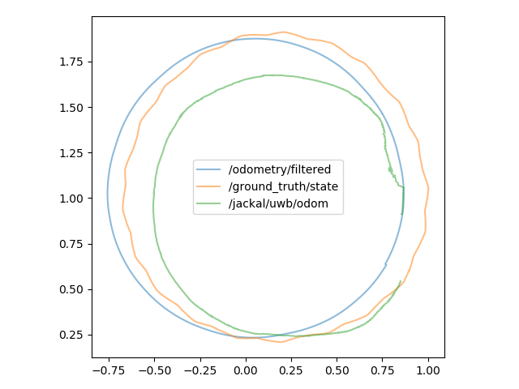
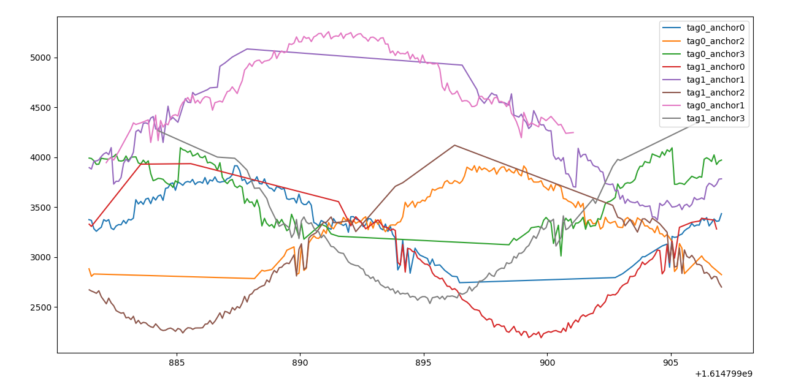

# Jackal Ad-Hoc Ultra-wideband localization

    
    
    
    
    
    

## 1. Table of contents

- [Jackal Ad-Hoc Ultra-wideband localization](#jackal-ad-hoc-ultra-wideband-localization)
  - [1. Table of contents](#1-table-of-contents)
  - [2. Project Description](#2-project-description)
  - [3. Installation](#3-installation)
  - [4. Files](#4-files)
    - [4.1. ukf_uwb_localization.py](#41-ukf_uwb_localizationpy)
    - [4.2. ekf_uwb_localization.py](#42-ekf_uwb_localizationpy)
    - [4.3. csv_creator.py](#43-csv_creatorpy)
    - [4.4. live_plotter.py](#44-live_plotterpy)
    - [4.5. location_drawer.py](#45-location_drawerpy)
    - [4.6. range_drawer.py](#46-range_drawerpy)
    - [4.7. actual_robot_position.py](#47-actual_robot_positionpy)

## 2. Project Description

This project is meant to implement a localization algorithm where a [Jackal](https://clearpathrobotics.com/jackal-small-unmanned-ground-vehicle/) is combined with [Decawave Ultra-widebands](https://www.decawave.com/product/mdek1001-deployment-kit/) and is meant to be able to localize itself with both mobile and stationary anchors in the world.

## 3. Installation

This project uses [`ROS Melodic`](http://wiki.ros.org/melodic) as its ROS backend.

To setup:

1. Either create a catkin workspace or navigate to its `src` folder
2. `git clone https://github.com/Marius-Juston/UWB-Localization.git`
3. This project is also associated with [UWB-Jackal-World](https://github.com/AUVSL/UWB-Jackal-World)
   - Follow this page if you want to install the Gazebo environement for this project, though it is not necessary.
4. If you choose to not install Gazebo environement be sure to have the `gtec_rosmsgs` installed
    - Create a `gtec` folder in your catkin's `src`
    - `git clone https://github.com/valentinbarral/rosmsgs`
    - This installs the custom UWB ranging messages
    - Navigate to your base `cakin_ws` folder
    - `rospack profile`
    - `catkin_make`
    - `source ~/catkin_ws/devel/setup.bash`
      - This step is very important. Be sure to run this every time you open up a new terminal. If you do not you will get errors when trying to run the world, that you cannot see certain packages.
      -  To make things easier if you only have a single ROS build and  `catkin_ws`, then you can run: 
      - `echo "source ~/catkin_ws/devel/setup.bash" > ~/.bashrc`
      -  This will allow you to not have to run the source command every time.

## 4. Files

### 4.1. ukf_uwb_localization.py

This runs an Unscented Kalman Filter based on a "Constant turn rate and velocity magnitude" (CTRV) non linear process model. 

This is the program that you should run for the more accurate localization estimations and is what this project is focussing on.

The CTRV assumes that the acceleration is the noise and that the velocity and the turn rate is constant. This is better suited to mobile robots who turn following the bycicle model.

This unscented kalman filter outputs with a rate of 60HZ and takes in the Jackal's Odometry and the UWB range with its associated anchor point location.

For a better explanation of the process model and how this UKF works in general:
- https://fevemania.github.io/blog/mathematic-formula-note-of-unscented-kalman-filter/

To use this:

- `rosrun uwb_localization ukf_uwb_localization.py`

### 4.2. ekf_uwb_localization.py

This runs an Kalman Filter with a linear process model for the x, y, and z dimensions. This model however is more suited to UAV which are unconstrained in their motion and is thus discontinued for this project.

This kalman filter outputs with a rate of 60HZ and takes in the Jackal's Odometry and the UWB range with its associated anchor point location.

To use this:

- `rosrun uwb_localization ekf_uwb_localization.py`

### 4.3. csv_creator.py

This converts a rosbag with the format: 

`rosbag record /ground_truth/state /gtec/toa/anchors /gtec/toa/ranging /odometry/filtered`

In to a csv file that be read and used offline. This can be usefull if you want to remove ROS from the equation all together. 

To use this:

1. `rossun uwb_localization csv_creator.py`
2. Run the rosbag you want to convert (i.e. `rosbag play *.bag`)
   - Be carefull because this csv_creator assumes that the anchors are currently stationary 

### 4.4. live_plotter.py

This is an interface to create live matplotlib plots. Use the `LivePlotter` class to create the live plots.
Ignore the warnings or errors that apprear when running this.

### 4.5. location_drawer.py

This plots in real-time the location of the robot's positions in a matplotlib graph.

By default it plots:
- The actual robot's position (`/ground_truth/state`)
- The odometry position (`/odometry/filtered`)
- The UWB localization output (`/jackal/uwb/odom`) 

To use:
- `rosrun uwb_localization location_drawer.py`
  - Default parameters
- `rosrun uwb_localization location_drawer.py /jackal/uwb/odom`
  - Custom odometry message

### 4.6. range_drawer.py

This plots in real-time the range measurements of the worlds anchor points as they reach the tags in a matplotlib graph.

For these plots it is normal to have range measurements that come and go due to the nature of UWB sensors being obstructed by line of sight.

To use:
- `rosrun uwb_localization range_drawer.py`

### 4.7. actual_robot_position.py

This is a deprecated program that used to output the robot's position based on its base_link tf.
